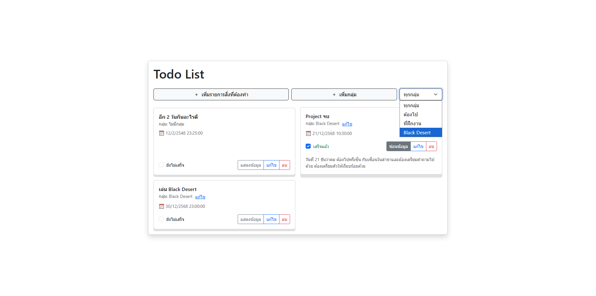
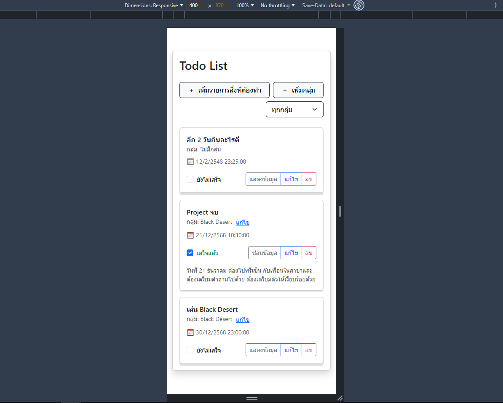
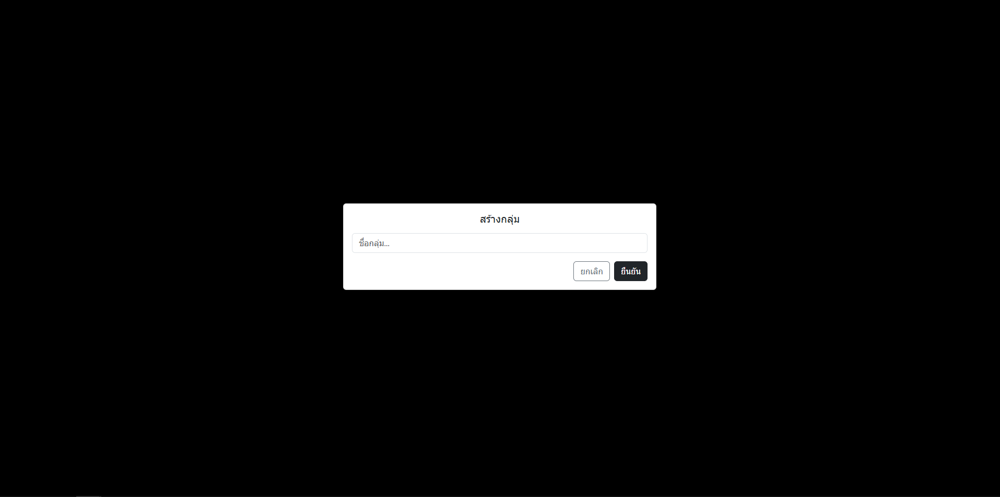
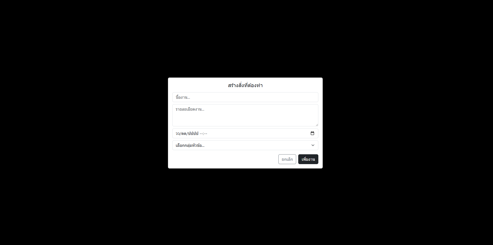
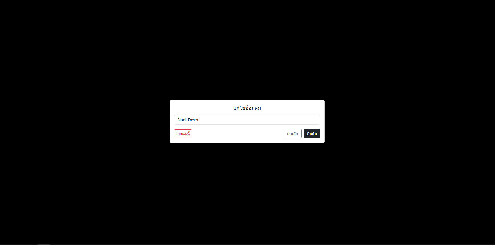
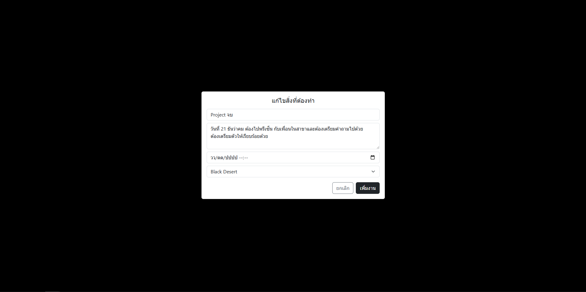

# Todo List – Frontend

Todo List สำหรับรายการสิ่งที่ต้องทำ พร้อมจัดกลุ่ม แก้ไข ลบ ดูรายละเอียด และกำหนกวันเวลาได้  
โดยใช้งาน ***Vue3 + Vite + TypeScript*** ในการทำ ***Frontend***
---------------
> :memo: **Note:** มีการใช้งาน AI เข้ามาบางส่วนใน Project นี้!

> ### Features in Todo List
> - เพิ่ม/ลบ/แก้ไข สิ่งที่ต้องทำ
> - เพิ่ม/ลบ/แก้ไข กลุ่มงาน
> - แสดงรายการทั้งหมดหรือ Filter เลือกตามกลุ่ม
> - แสดงรายละเอียดของงาน
> - แสดงวัน/เวลาที่ต้องทำ
> - Checkbox ทำงานเสร็จแล้ว

### Screenshot UI

  

> ### Tech Stack in Project
> - Vue 3
> - Vite
> - TypeScript
> - Bootstrap 5
> - Axios *(For connect Backend API)*

### Project Structure *(Frontend)*
    my-todo-list-app/
    │--- public/
    |   |-- Nature.svg 
    │-- src/
    │   |-- api/todoApi.ts
    │   |-- assets/Nature.svg
    │   |-- components/
    │   │   |__TodoForm.vue
    │   |-- App.vue
    │   |-- main.ts
    │   |__ style.css
    │-- index.html
    |-- package-lock.json
    │-- package.json
    │-- tsconfig.json
    │-- tsconfig.app.json
    │-- vite.config.ts
    |__ README.md

### My Extensions for Develop

1. <a href="https://marketplace.visualstudio.com/items?itemName=esbenp.prettier-vscode" target="_blank">Prettier - Code formatter</a>
2. <a href="https://marketplace.visualstudio.com/items?itemName=ritwickdey.LiveServer" target="_blank">Live Server</a>
3. <a href="https://marketplace.visualstudio.com/items?itemName=Vue.volar" target="_blank">Vue (Official)</a>
4. <a href="https://marketplace.visualstudio.com/items?itemName=naumovs.color-highlight" target="_blank">Color Highlight</a>

### Installation

1. Clone Project

        git clone <repo-url>
        cd my-todo-list-app

2. Install Dependencies

        npm install

3. Run Dev Server

        npm run dev

4. Open Browser

        http://localhost:xxxx/

### API Connection

> ไฟล์ใน Folder src/api/todoApi.ts และ App.vue Frontend ใช้ baseURL เป็น

        http://localhost:3000/api   

> *ดังนั้นต้องรัน Backend ก่อนถึงจะใช้งานได้*

### หมายเหตุ
>  :warning: โปรเจกต์นี้ใช้เพื่อการเรียนรู้การสร้าง Full Stack Web Application เท่านั้น!